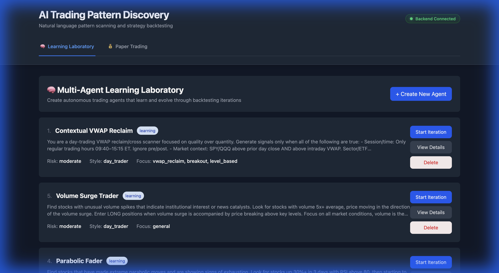
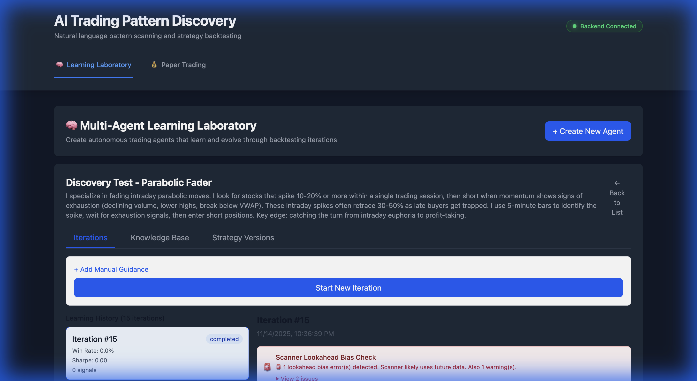
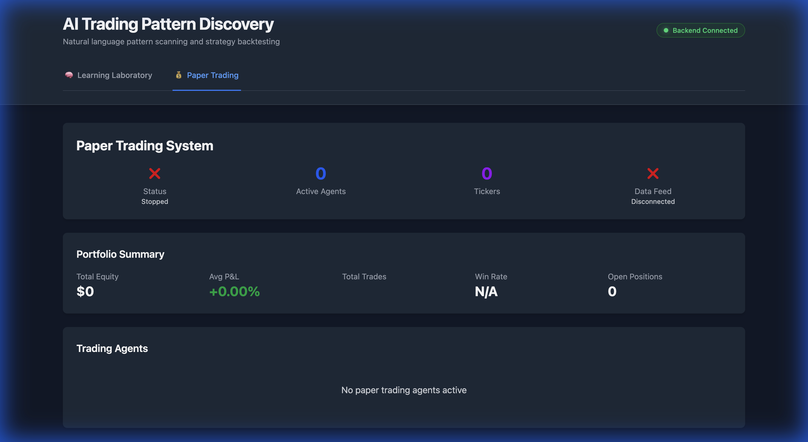

# 🧠 AI Prop Firm - Autonomous Trading Strategy Evolution

**An AI-powered platform where trading agents autonomously learn, evolve, and optimize strategies through continuous backtesting iterations.**

> **Note:** This project is a proof of concept demonstrating how AI trading agents can be trained using natural language to develop strategies, utilizing backtesting to create a learning feedback loop.

## 🚀 Vision: Use Natural Language to Build a Quant Trading Firm

The goal of **AI Prop Firm** is to democratize quantitative trading by enabling users to create sophisticated trading strategies using plain English. 

The platform leverages Large Language Models (LLMs) to bridge the gap between human intent and executable code. By simply describing a strategy (e.g., "Find stocks that gap up on earnings and fade the move"), the system autonomously:

1.  **Understands** the financial concepts and trading logic.
2.  **Generates** executable TypeScript code for scanning and execution.
3.  **Backtests** the strategy against historical data from Massive API (formerly Polygon).
4.  **Refines** the strategy based on performance metrics, creating a self-improving feedback loop.

---

## � Platform Overview

### Learning Laboratory
The central hub where you manage AI agents and monitor their learning progress.


### Agent Evolution
Deep dive into an agent's learning history. See how its win rate and Sharpe ratio improve over time as it refines its strategy.


### Paper Trading Dashboard
Graduate successful agents to live market conditions. Monitor real-time performance, P&L, and active positions in a simulated environment.


---

## �💡 Key Capabilities

### 1. Natural Language to Code
Users describe strategies in plain English. The system uses the **Anthropic Claude 4.5 Sonnet** API to convert these instructions into robust, type-safe TypeScript code.

```bash
Input: "Find parabolic exhaustion patterns: stocks that rise 100%+ in 3 days, then close below VWAP with volume confirmation."

Output: Fully functional TypeScript scanner and execution logic.
```

### 2. Autonomous Learning Loop
Unlike traditional backtesting where humans manually tweak parameters, AI Prop Firm automates the optimization process:
*   **Generation**: Agent creates a strategy version.
*   **Validation**: Strategy is backtested against historical data.
*   **Analysis**: AI reviews execution logs, identifying why trades won or lost.
*   **Evolution**: Agent self-updates the code to improve win rate and Sharpe ratio.

### 3. Professional-Grade Simulation
*   **Data Source**: High-fidelity historical and real-time data via **Massive API (formerly Polygon)**.
*   **Paper Trading**: Successful agents graduate to a live paper trading environment with realistic slippage and commission models.
*   **Risk Management**: Enforced position limits, stop losses, and purchasing power checks.

---

## 🏗️ Architecture: The Learning Loop

### Single Iteration Flow

```
┌─────────────────────────────────────────────────────────────────┐
│                     Learning Iteration N                         │
└─────────────────────────────────────────────────────────────────┘
                              ↓
        ┌─────────────────────────────────────┐
        │   1. GENERATE STRATEGY              │
        │   - Read previous iteration results │
        │   - Apply manual guidance if given  │
        │   - Generate improved scanner       │
        │   - Create execution logic          │
        └─────────────────────────────────────┘
                              ↓
        ┌─────────────────────────────────────┐
        │   2. EXECUTE SCANNER                │
        │   - Run TypeScript against SQLite   │
        │   - Filter by quality (score > 50)  │
        │   - Diversify (max 2 per ticker)    │
        │   - Select top 10 for backtesting   │
        └─────────────────────────────────────┘
                              ↓
        ┌─────────────────────────────────────┐
        │   3. BACKTEST SIGNALS               │
        │   - 5 execution templates:          │
        │     • Conservative (2% stop, 3% target)│
        │     • Aggressive (3% stop, 6% target) │
        │     • Time-based (max 2-day hold)   │
        │     • ATR Adaptive (dynamic stops)  │
        │     • Price Action (trailing stop)  │
        └─────────────────────────────────────┘
                              ↓
        ┌─────────────────────────────────────┐
        │   4. ANALYZE RESULTS                │
        │   - AI expert analysis via Claude   │
        │   - Identify winning patterns       │
        │   - Suggest 3-5 specific refinements│
        │   - Update knowledge base           │
        └─────────────────────────────────────┘
                              ↓
        ┌─────────────────────────────────────┐
        │   5. STORE & LEARN                  │
        │   - Save iteration to database      │
        │   - Record all scripts and results  │
        │   - Update agent's knowledge base   │
        │   - Prepare context for iteration N+1│
        └─────────────────────────────────────┘
                              ↓
                    Repeat automatically or
                    wait for manual guidance
```

### Multi-Agent System

```
┌──────────────────┐  ┌──────────────────┐  ┌──────────────────┐
│   Agent 1        │  │   Agent 2        │  │   Agent 3        │
│   Parabolic      │  │   VWAP Bounces   │  │   Opening Range  │
│   Exhaustion     │  │   Intraday       │  │   Breakouts      │
└────────┬─────────┘  └────────┬─────────┘  └────────┬─────────┘
         │                     │                     │
         └─────────────────────┼─────────────────────┘
                               │
                    ┌──────────▼──────────┐
                    │  Shared Knowledge   │
                    │  - Market insights  │
                    │  - Parameter prefs  │
                    │  - Pattern rules    │
                    └─────────────────────┘
```

**Each agent learns independently but shares knowledge:**
*   Cross-pollination of successful techniques
*   Avoid repeating failed experiments
*   Build collective intelligence

---

## ✨ Features Deep Dive

### Discovery Mode (Rapid Testing)
Discovery mode enables rapid strategy exploration by using pre-built execution templates instead of generating custom scripts for every iteration.
*   **Speed**: 5-10x faster iteration cycles.
*   **Efficiency**: Unified script generation and sequential execution.
*   **Use Case**: Early stage exploration to test if a pattern has an edge before optimizing execution logic.

### Custom Execution Scripts
For advanced optimization, the agent generates custom execution logic tailored to the strategy's specific intent.
*   **Context Aware**: Strategies like "Gap and Go" get logic specific to gap plays (e.g., waiting for pullback).
*   **Adaptive Risk**: Stop losses and targets are dynamically generated based on the pattern's volatility profile.

### Manual Guidance
While the system is autonomous, humans remain in the loop. You can provide specific guidance to steer the learning process of any agent.
*   **Example**: "The signals are too conservative. Scan the last 6 months instead of 60 days to find rare events."
*   **Priority**: Manual guidance overrides automated suggestions, acting as a "director" for the AI.

---

## 🎓 Paper Trading System

**Graduate successful agents from backtesting to live market simulation.**

Once an agent demonstrates consistent performance (e.g., high win rate, Sharpe > 2.0), it can be graduated to the **Paper Trading** environment. This crucial step validates that the strategy works with real-time data and isn't just overfitting to history.

### Key Features
*   **Virtual Accounts**: Each agent gets its own isolated $100,000 paper trading account.
*   **Real-Time Data**: Integrates with Massive API for live market data (60s polling).
*   **Realistic Fills**: Simulates slippage (0.01%) and commissions ($0.50/trade).
*   **Risk Management**: Enforces position limits, stop losses, and buying power checks.
*   **Live Monitoring**: Track positions, P&L, and performance in real-time.

### Graduation Process
1.  **Identify**: Find an agent with a proven backtested edge.
2.  **Graduate**: Run the graduation script or use the UI to promote the agent.
3.  **Deploy**: The agent moves to the `paper_trading` pool and begins monitoring the live market.

---

## 🚀 Quick Start

### Prerequisites
*   Node.js 18+
*   Anthropic API Key
*   Polygon.io (Massive API) API Key

### Installation

```bash
# Clone the repository
git clone https://github.com/edkim/ai-prop-firm.git
cd ai-prop-firm

# Install Backend
cd backend && npm install
cp .env.example .env
# Edit .env with your API keys

# Install Frontend
cd ../frontend && npm install
```

### Running the Platform

```bash
# Terminal 1 - Backend
cd backend && npm run dev

# Terminal 2 - Frontend
cd frontend && npm run dev
```

Visit `http://localhost:5173` to access the Learning Laboratory.

---

## ⚠️ Disclaimer

This project is for educational and research purposes only. It is **not** financial advice. Trading involves significant risk, and past performance of AI-generated strategies does not guarantee future results. Do not trade with real money based solely on this software.
